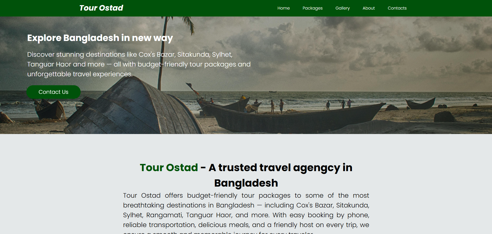
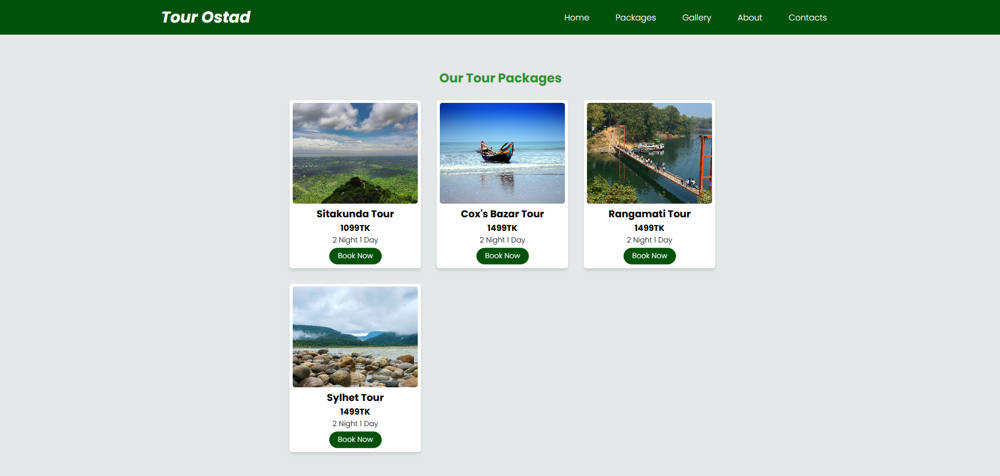

# Tour Ostad

**Tour Ostad** is a tour agency website built with HTML, CSS, JavaScript, and PHP connected to a MySQL database.  

## **Live Site:** [Visit Tour Ostad](https://raihan-89.github.io/Tour-Ostad-Website/)
## 🌟 Features

- About the **Tour Ostad** agency
- Display tour packages dynamically using JavaScript
- Image gallery of previous tours
- Contact form with PHP & MySQL backend

## 📁 Technologies Used

- HTML, CSS, JavaScript
- PHP & MySQL

## Website Preview 👓

<h3 align="center">Home Page</h3>



<h3 align="center">Packages Page</h3>



<h3 align="center">Gallery Page</h3>


<h3 align="center">About Page</h3>


<h3 align="center">Contact Page</h3>


## 🔌  How to Run Locally

1. Clone the repository in **c/xampp/htdocs** folder:
   ```bash
   git clone https://github.com/Raihan-89/Tour-Ostad-Website.git
2. Open the Repository Folder:
   ```bash
   cd 'Tour-Ostad-Website'
3. Run the XAMPP control panel and start:
   - Apache
   - MySQL
4. Open Browser and enjoy the website:
   ```bash
   localhost/index.html

## 🙏 Support

Don't forget to leave a 🌟 star
